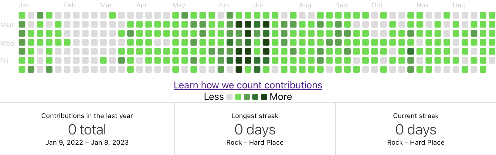

## github-calendar
- repo: https://github.com/Bloggify/github-calendar
- 깃허브 컨트리뷰션 스탯 관련 베이스 컴포넌트, 툴팁과 통계 지원.
- 가장 기초적인 기능 제공. Bloggify API 제공. 아래 라이브러리들의 베이스.
  - `github-alike-calendar`
  - `github-calendar-element`
  - `github-calendar-web-component`
  - `react-ts-github-calendar`
  - `@axetroy/react-github-calendar`
  - `@pengliheng/github-report`
  - `@philipwhiuk/react-github-calendar`
- div.calendar를 body에 직접 삽입하고, 스크립트 태그를 작성하면 API를 document.querySelector로 불러와 캘린더를 직접 구현하는 코드로 만들어짐. document에 접근하기 때문에 리액트에서는 방법을 다르게 써야함.


[Demo and documentation](https://grubersjoe.github.io/react-github-calendar/)

## react-github-calendar
- repo: https://github.com/grubersjoe/react-github-calendar
- [`react-activity-calendar`](https://github.com/grubersjoe/react-activity-calendar)를 UI베이스로 사용해서 기존 컴포넌트보다 더 예쁘고, 컬러 변경이나 스타일 변경이 쉽다. 리포지토리 리드미에는 `react-tooltip`을 `children`으로 넣어주면 툴팁이 작동한다고 하는데, NextJS에서도 CRA에서도 안되는 것 같다.

```js
import ReactGithubCalendar from 'react-github-calendar';
import { Tooltip as ReactTooltip } from 'react-tooltip';

...
    <ReactGithubCalendar
        username="USERNAME"
        color="#0969da" // 간단하게 가장 어두운 색만 지정
        style={{
            margin: 'auto',
            display: 'block',
            maxWidth: '100%',
            height: 'auto',
            overflow: 'visible',
        }}>
        <ReactTooltip /> // 왜 안되지..
    </ReactGithubCalendar>
```


## react-ts-github-calendar
- repo: https://github.com/togami2864/react-ts-github-calendar
- [`github-calendar`](https://github.com/IonicaBizau/github-calendar) 리액트 랩핑 컴포넌트(`react-activity-calendar`) UI 아님, 기존 컴포넌트 랩핑만 한 것, 
- 타입스크립트 타입 정의되어 있어 모듈 정의 필요없음, NextJS 적용 가능
- How to
    next의 dynamic import를 사용해 렌더링한다.

    ```js
    import dynamic from 'next/dynamic';

    const ReactGitHubCalendar = 
        dynamic(() => import('react-ts-github-calendar'), {
            ssr: false,
        });
    ...
    <ReactGitHubCalendar
        userName="USERNAME"
        responsive={true}
        tooltips={true}
        global_stats={true}
        cache={86400000} // (24 * 60 * 60) *1000
        summary_text={"Summary of pull requests, issues opened, and commits made by USERNAME"}
    />
    ```



# :rotating_light: Conclusion

NextJS로 만든 이력서에 깃허브 잔디를 적용하면서 시행착오들을 겪었다. `react-github-calendar`을 가장 먼저 사용해봤는데, UI가 예쁘고 좋았지만 설명에 나와있는 `tooltip` 기능이 제대로 작동하지 않았다. (예제를 좀 더 찾아봐야 할 것 같음). 그리고 `GlobalStats`까지 제공하는 라이브러리를 찾다보니 베이스라 할 수 있는 `github-calendar`와 `react-ts-github-calendar`, 그리고 `react-activity-calendar`까지 사용해보게 됐다.

- `github-calendar` - 리액트 적용 어려움(가능함). global_stats, tooltip 기본 지원.
- `react-github-calendar` - `react-activity-calendar` UI를 사용해 스타일 컨트롤이 쉽고 기본적으로 예쁘다. global_stats 기본 제공하지 않는다. `react-tooltip`과 호환된다고 하는데 아직 방법을 모르겠다.
- `react-activity-calendar` - UI에 다양한 시도를 해볼 수 있다. API가 연결되어 있지 않은 잔디 캘린더 그 자체이기 때문에 다른 용도로도 사용할 수 있다.
- `react-ts-github-calendar` - 가장 쓰기 편하고, types가 정의되어 있어 타입스크립트 리액트 프로젝트에서 사용하기 수월하다. `github-calendar`을 리액트+타입스크립트로 랩핑한 컴포넌트이며 `react-activity-calendar`와 관련이 없는 만큼 UI는 그대로라 그다지 예쁘지는 않다.

마우스오버 툴팁과 글로벌 스탯(+Streak)을 간단하게 기본적으로 제공하는 `github-calendar`을 직접 리액트로 랩핑해 사용해왔는데, global_stats는 API 자체적인 특성 상 호출이 실패하는 때가 종종 있는것 같다. 이 문제를 커버해 글로벌 스탯 호출에 실패했을 때 컬럼들을 감추는 코드를 작성하거나, 그냥 이 부분 자체를 포기해야 할텐데, API를 직접 호출하고 실패여부를 체크하려면 Bloggify API를 직접 호출해서 `react-activity-calendar` UI를 사용하는 것도 괜찮을 것 같다.