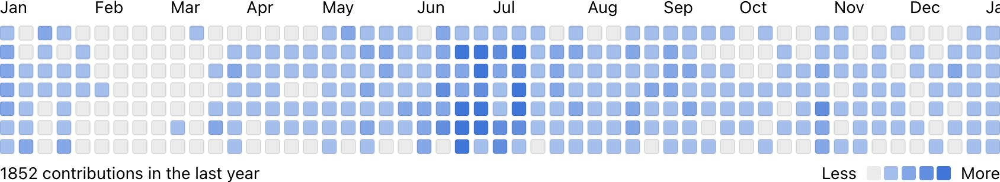
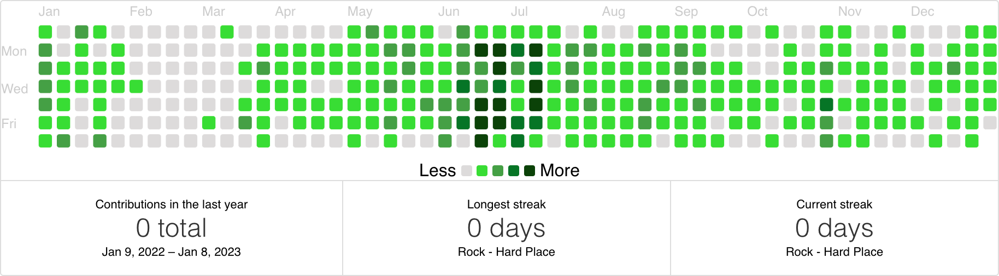

## react-github-calendar
- repo: https://github.com/grubersjoe/react-github-calendar
- [`react-activity-calendar`](https://github.com/grubersjoe/react-activity-calendar)를 토대로 만들어진 리액트 컴포넌트. 좀 더 예쁜데 글로벌스탯/툴팁 지원이 안되는 것 같다.

[데모 사이트](https://grubersjoe.github.io/react-github-calendar/)

## github-calendar
- repo: https://github.com/Bloggify/github-calendar
- 깃허브 컨트리뷰션 스탯 관련 베이스 컴포넌트, 툴팁과 통계 지원.
  - `github-alike-calendar`
  - `github-calendar-element`
  - `github-calendar-web-component`
  - `react-ts-github-calendar`
  - `@axetroy/react-github-calendar`
  - `@pengliheng/github-report`
  - `@philipwhiuk/react-github-calendar`

[Demo and documentation](https://grubersjoe.github.io/react-github-calendar/)

